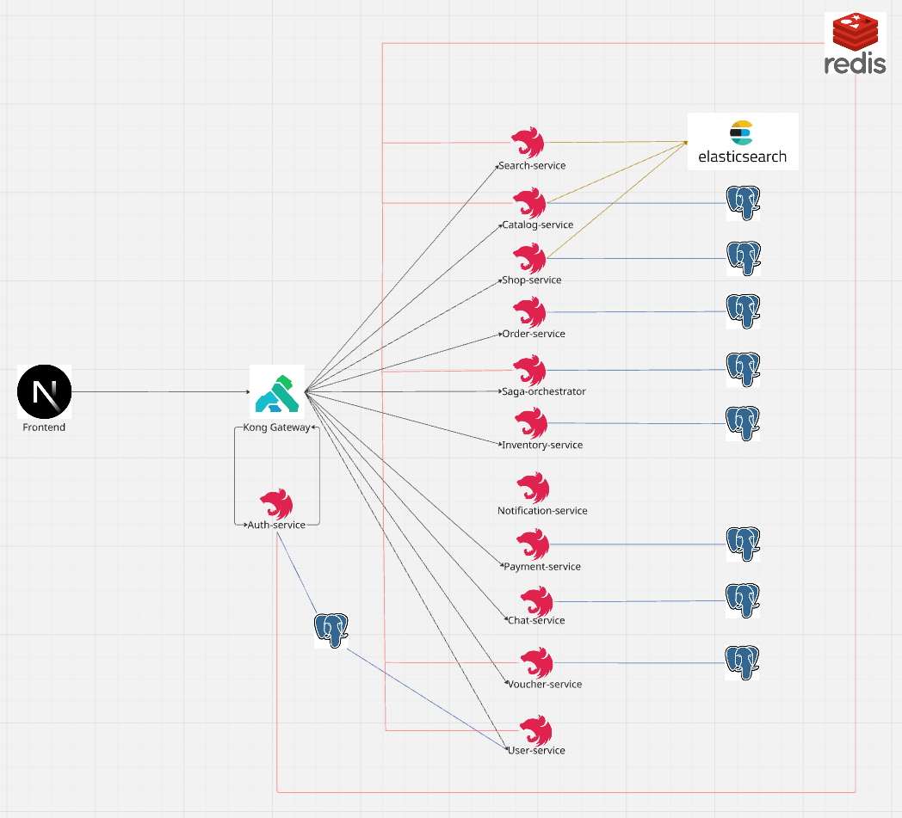

# ThuongMaiDienTu (TMDT)

## Frontend

- [Frontend-TMDT](https://github.com/nhattrinh7/Frontend-TMDT)

## Backend

- [Auth-service-TMDT](https://github.com/nhattrinh7/Auth-service-TMDT)
- [User-service-TMDT](https://github.com/nhattrinh7/User-service-TMDT)
- [Voucher-service-TMDT](https://github.com/nhattrinh7/Voucher-service-TMDT)
- [Notification-service-TMDT](https://github.com/nhattrinh7/Notification-service-TMDT)
- [Payment-service-TMDT](https://github.com/nhattrinh7/Payment-service-TMDT)
- [Chat-service-TMDT](https://github.com/nhattrinh7/Chat-service-TMDT)
- [Search-service-TMDT](https://github.com/nhattrinh7/Search-service-TMDT)
- [Order-service-TMDT](https://github.com/nhattrinh7/Order-service-TMDT)
- [Shop-service-TMDT](https://github.com/nhattrinh7/Shop-service-TMDT)
- [Catalog-service-TMDT](https://github.com/nhattrinh7/Catalog-service-TMDT)
- [Saga-orchestrator-TMDT](https://github.com/nhattrinh7/Saga-orchestrator-TMDT)
- [Inventory-service-TMDT](https://github.com/nhattrinh7/Inventory-service-TMDT)

